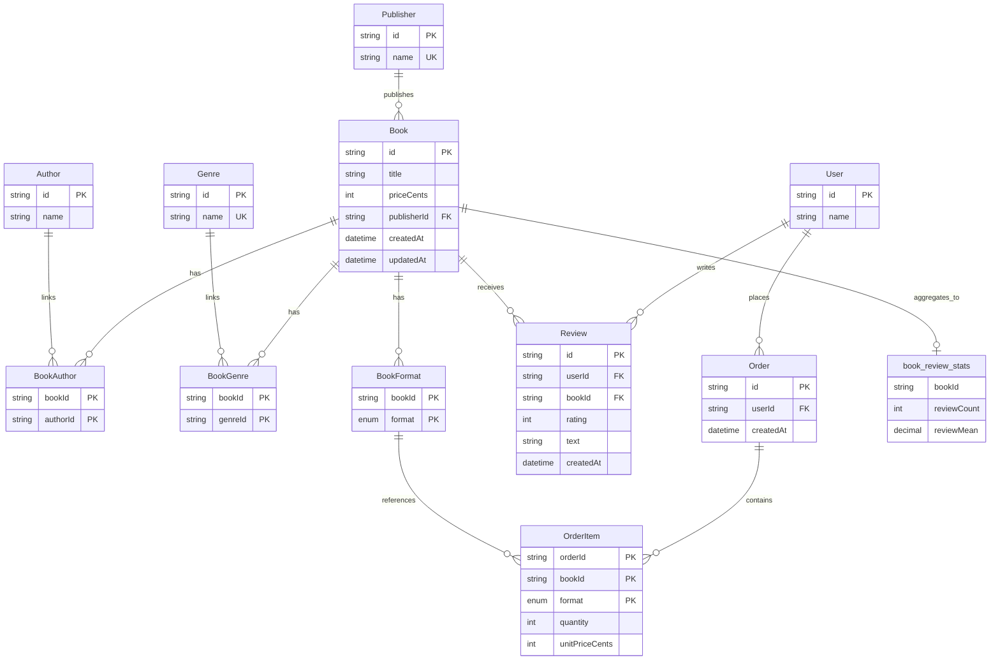

# Current Entity Graph

This graph reflects the current database entities defined in `api/prisma/schema.prisma`, plus the derived SQL view used for review aggregates.

## Notes

- `BookAuthor`, `BookGenre`, and `BookFormat` are join entities.
- `OrderItem` references `BookFormat` by composite key (`bookId`, `format`).
- `Review` enforces one review per user per book via unique (`userId`, `bookId`).
- `book_review_stats` is a SQL view derived from `Review` (not a Prisma model).
- `Format` enum values: `HARDCOVER`, `SOFTCOVER`, `AUDIOBOOK`, `EREADER`.
